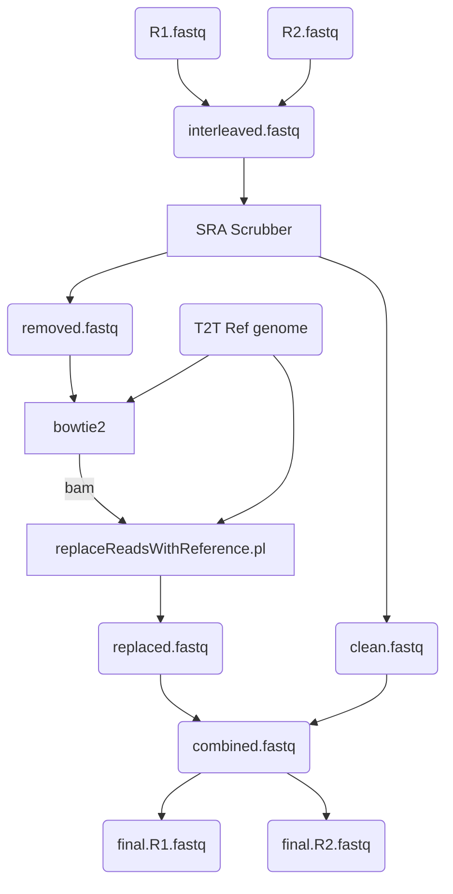

# Read_anonymizer

## Overview  
This simple workflow to replaces the sequence of human read contaminants from individuals (patients) with the corresponding sequence in a published human reference genome. Motivation for this project came from a need to prepare technical benchmark datasets containing human contamination with:  

1. known quantities,
1. more realistic distribution than simulated reads, 
1. read sequences derived from published references

---

---
## Description
This workflow uses:
1. NCBI human read removal tool (aka 'SRA scrubber') -- https://github.com/ncbi/sra-human-scrubber  
1. Bowtie2  
1. ReplaceReadsWithReference.pl -- https://github.com/lskatz/lskScripts/blob/master/scripts/replaceReadsWithReference.pl  
1. Fasten -- https://github.com/lskatz/fasten  
1. T2T human reference genome assembly -- https://www.ncbi.nlm.nih.gov/bioproject/559484  
1. BBTools (bbsplitpairs.sh) -- https://jgi.doe.gov/data-and-tools/bbtools/  
