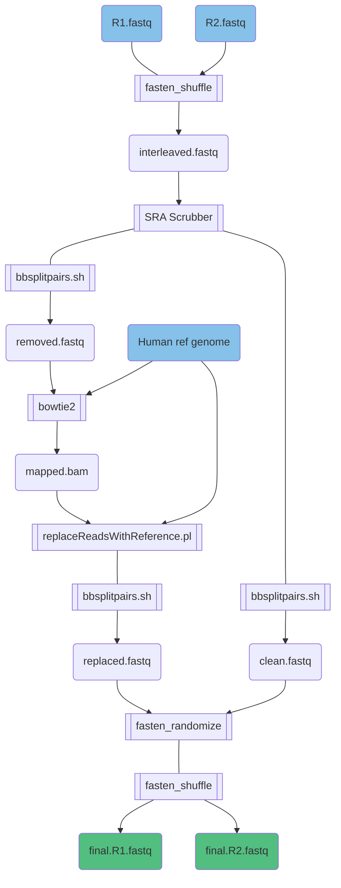

# Read_anonymizer

[[_TOC_]]

## Overview  
This simple workflow to replaces the sequence of human read contaminants from individuals (patients) with the corresponding sequence in a published human reference genome. Motivation for this project came from a need to prepare technical benchmark datasets containing human contamination with:  

1. known quantities,
2. more realistic distribution than simulated reads, and
3. read sequences derived from published references.

---

---
## Workflow scripts

### Internal use only

1. `ReadCleanBot.internal.sh`  
Pipeline run within TOAST private scicomp workspace to prepare reads for dataset 6 of Xiaoli *et al.*.

1. `ReadCleanBot.aspen.sh`  
Executable for submitting `ReadCleanBot.internal.sh` to Aspen HPC for improved runtime.  

### Generalized for distribution

1. `ReadCleanBot.general.sh`  
Simplified and generalized for external distribution.  
 
    *Command:* 
    ~~~
    ./src/ReadCleanBot.general [in-dir] [out-dir] [ref-file]
        [in-dir]   Path to directory of input reads pairs in fastq format with filenames like `name_S1_L001_R[12]_001.fastq`
        [out-dir]  Path to new output directory.
        [ref-file] Path to human reference genome assembly fasta (must be indexed for bowtie2).
    ~~~

## Dependencies
This workflow uses:
1. NCBI human read removal tool (aka 'SRA scrubber') -- [software repo](https://github.com/ncbi/sra-human-scrubber)  
2. Bowtie2 -- [software repo](https://github.com/BenLangmead/bowtie2)
3. ReplaceReadsWithReference.pl -- [script url](https://github.com/lskatz/lskScripts/blob/master/scripts/replaceReadsWithReference.pl)  
4. Fasten -- [software repo](https://github.com/lskatz/fasten)
5. T2T human reference genome assembly FastA file -- [file url](https://www.ncbi.nlm.nih.gov/bioproject/559484)
6. BBTools (bbsplitpairs.sh) -- [software repo](https://jgi.doe.gov/data-and-tools/bbtools/)  
